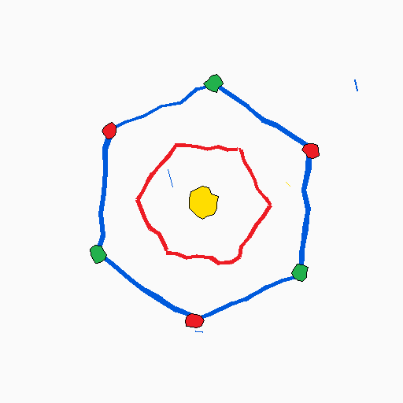
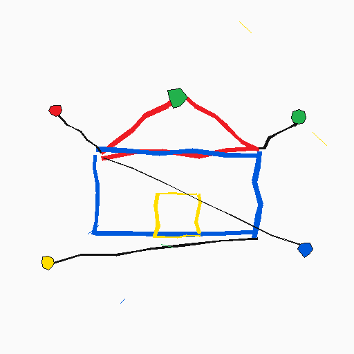

# About

Hi, I'm GuinEeeeeeeeeeeeeeeeeeeeeeeerm.
I write, build, and break whatever comes to mind.

## guinjaaaaaaaaaaaaaaaaaaaaakeop

[github.com/guinjaaaaaaaaaaaaaaaaaaaaakeop](https://github.com/guinjaaaaaaaaaaaaaaaaaaaaakeop)

None of the existing harnesses quite fit the way I work, so I'm building my own for development, planning, and design.

I'm prototyping a harness that:

- controls which skills and plugins each project uses (Hunsu),
- keeps a model of meaning, so that people and agents new to a project can work together while the plan and the implementation stay consistent (Mangsang), and
- decides how the work gets done, then runs it, looks back on it, and records it (Chongdae, Hacheong, Dwitbuk).
